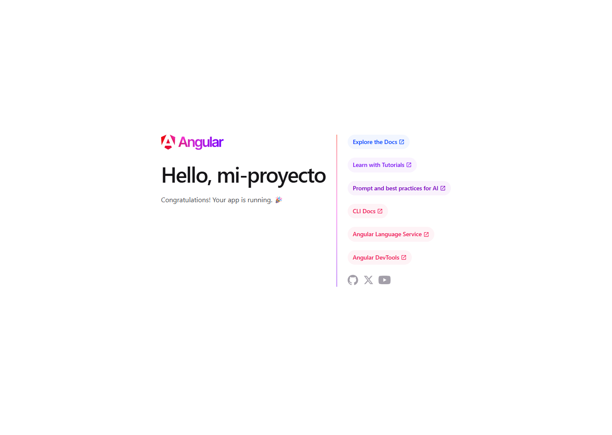
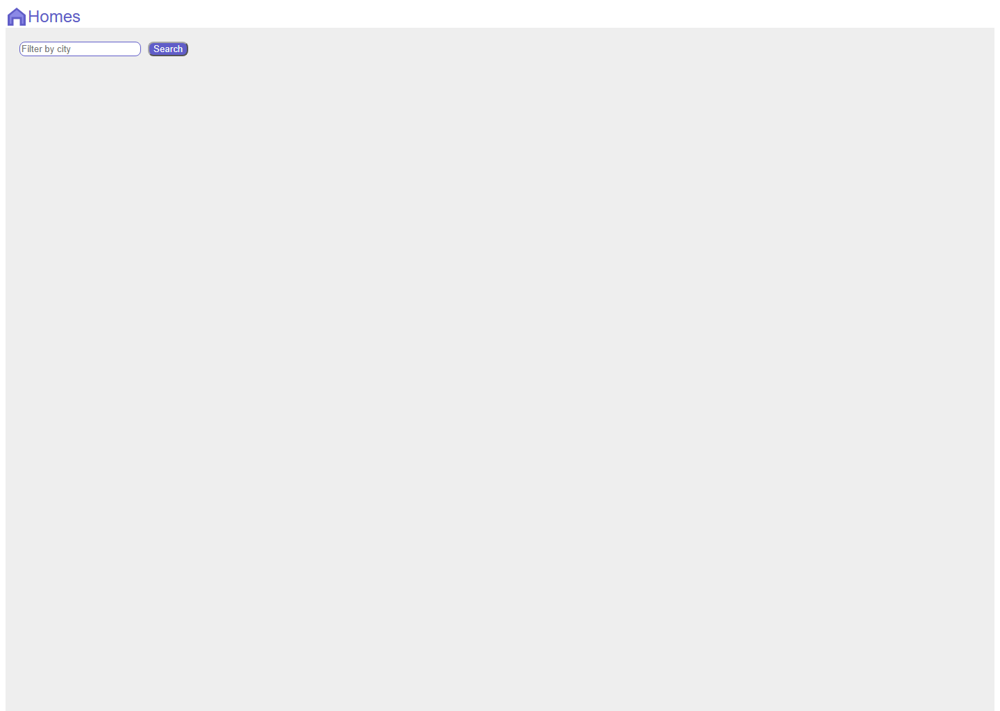
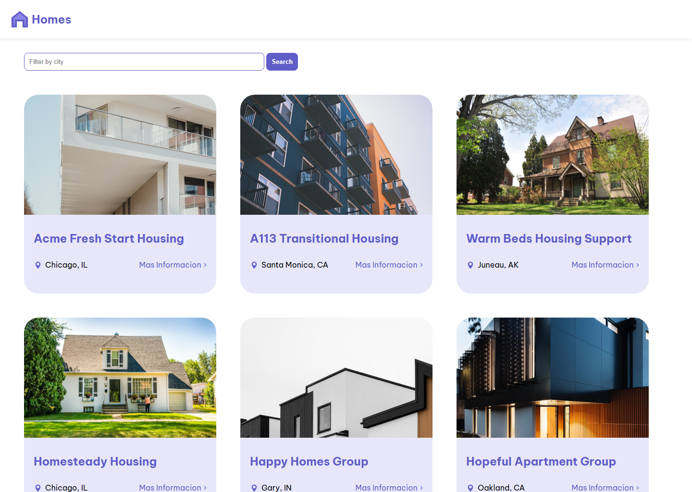
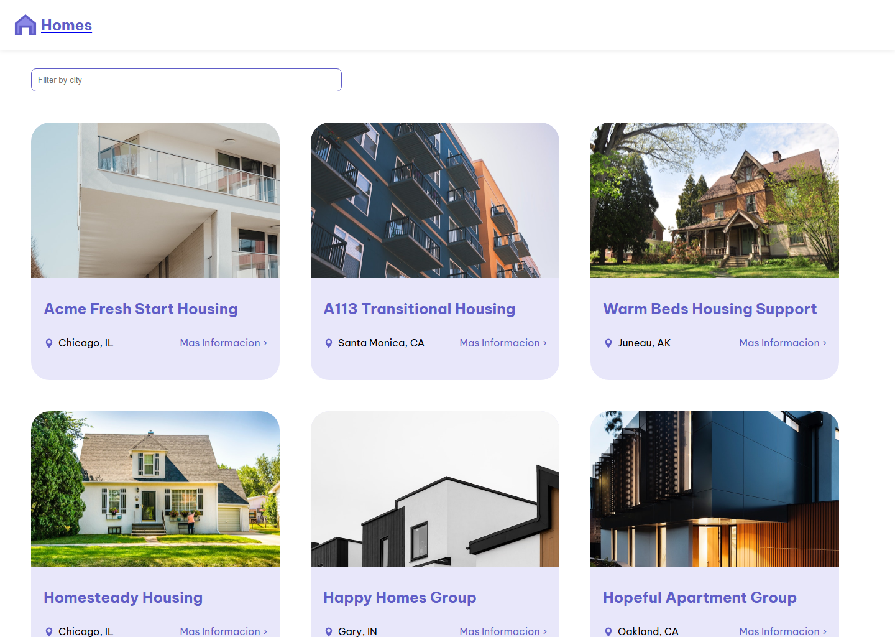

# Bitacora: Mi primera aplicacion Angular

## Datos de la entrega

- **Estudiante:** Javier Alexander Hurtado Guaca
- **Actividad:** Mi primera aplicacion Angular
- **Tutorial seguido:** [Your first Angular app](https://angular.dev/tutorials/first-app)
- **Repositorio:** https://github.com/GustavoNightmare/HOMES-APP

## Objetivo

Documentar el desarrollo de una aplicacion Angular para consultar viviendas disponibles y ver el detalle de cada una. Cada avance registra los cambios realizados en el codigo, su resultado visible y una evidencia en imagen.

## Avances

### Avance 01 - 24 de septiembre de 2026

**Objetivo del paso:** Crear y comprobar el proyecto base generado con Angular CLI.

**Cambios realizados:**
- Se genero el proyecto Angular llamado `mi-proyecto` con su estructura inicial, configuracion de compilacion y pruebas.
- Se creo el componente raiz `App` con la pagina predeterminada de Angular.
- Se configuraron los archivos base de TypeScript, estilos globales y servidor de desarrollo.

**Resultado obtenido:**
La aplicacion se ejecuto correctamente y mostro la pantalla inicial de Angular con el mensaje de bienvenida. Este estado sirvio como punto de partida para desarrollar la aplicacion Homes.

**Evidencia:**

**Commit:** `76fecb9` - initial commit

### Avance 02 - 25 de septiembre de 2026

**Objetivo del paso:** Iniciar la interfaz de Homes y crear el componente de la pagina principal.

**Cambios realizados:**
- Se creo el componente `home` para organizar el contenido principal de la aplicacion.
- Se reemplazo la plantilla predeterminada de Angular por la cabecera de Homes con su logotipo.
- Se anadieron el campo de texto para buscar por ciudad y el boton de busqueda.
- Se incorporaron los estilos iniciales y el recurso grafico `homes-logo.svg`.

**Resultado obtenido:**
La aplicacion dejo de mostrar la pantalla generica de Angular y presento la estructura inicial de Homes: cabecera, logotipo y formulario de busqueda. Aun no se mostraban viviendas, porque el listado se implemento en el siguiente avance.

**Evidencia:**

**Commit:** `bb1db37` - comienzo curso, se creo el modulo de homes y se pusieron los logos

### Avance 03 - 01 de octubre de 2026

**Objetivo del paso:** Mostrar viviendas disponibles y habilitar la navegacion hacia el detalle de cada una.

**Cambios realizados:**
- Se creo la interfaz `HousingLocationInfo` para definir los datos de cada vivienda.
- Se implemento el servicio `Housing` con un listado inicial de viviendas.
- Se creo el componente `housing-location` para representar cada vivienda mediante una tarjeta con imagen, nombre y ubicacion.
- Se configuraron las rutas de inicio y detalle mediante `/details/:id`.
- Se anadio el componente `details` y el icono de ubicacion para la informacion de cada vivienda.

**Resultado obtenido:**
La pagina principal mostro una cuadricula de tarjetas de viviendas con imagenes, ciudad, estado y el enlace "Mas Informacion". Tambien quedo creada la ruta para consultar los datos de una vivienda especifica.

**Evidencia:**

**Commit:** `d85e98a` - ajustes y avances del instructivo

### Avance 04 - 04 de octubre de 2026

**Objetivo del paso:** Implementar el filtro de viviendas y completar la vista de detalle con un formulario de solicitud.

**Cambios realizados:**
- Se agrego `filteredLocationList` y el metodo `filterResults` en el componente `home`.
- Se conecto el campo de busqueda al evento de entrada para filtrar las viviendas por ciudad en tiempo real.
- Se incorporo un mensaje cuando no existen resultados para la ciudad buscada.
- Se anadieron formularios reactivos a la vista de detalle para capturar nombre, apellido y correo del solicitante.
- Se mejoraron los estilos y textos de la informacion detallada de cada vivienda.

**Resultado obtenido:**
La lista de viviendas se puede reducir escribiendo una ciudad en el buscador. La pagina de detalle tambien permite diligenciar una solicitud de vivienda mediante un formulario.

**Evidencia:**

**Commit:** `20620d1` - modulos de filtracion y busqueda

### Avance 05 - 04 de octubre de 2026

**Objetivo del paso:** Reemplazar el arreglo interno de datos por una fuente de datos local simulada.

**Cambios realizados:**
- Se creo el archivo `db.json` con las ubicaciones de vivienda usadas por la aplicacion.
- El servicio `Housing` paso de usar un arreglo en memoria a consultar `http://localhost:3000/locations` mediante `fetch`.
- Se adaptaron los componentes `home` y `details` para esperar respuestas asincronas.
- Se actualizo la deteccion de cambios para mostrar correctamente los datos obtenidos.

**Resultado obtenido:**
La aplicacion conservo el listado, el filtro y los detalles, pero ahora obtiene la informacion desde una API local simulada. Con esto se completo el flujo principal del tutorial: consultar viviendas, filtrar resultados y ver el detalle de cada opcion.

**Evidencia:**

**Commit:** `7126fde` - cambios de array a db

## Resultado final

Se completo una aplicacion Angular de consulta de viviendas. El resultado final incluye un listado dinamico de ubicaciones, filtro por ciudad, navegacion al detalle, formulario de solicitud y consumo de datos desde una API local simulada con `db.json`.

## Entregable

- Repositorio de GitHub: https://github.com/GustavoNightmare/HOMES-APP
- Bitacora y capturas: disponibles en la carpeta `docs` de este repositorio.
